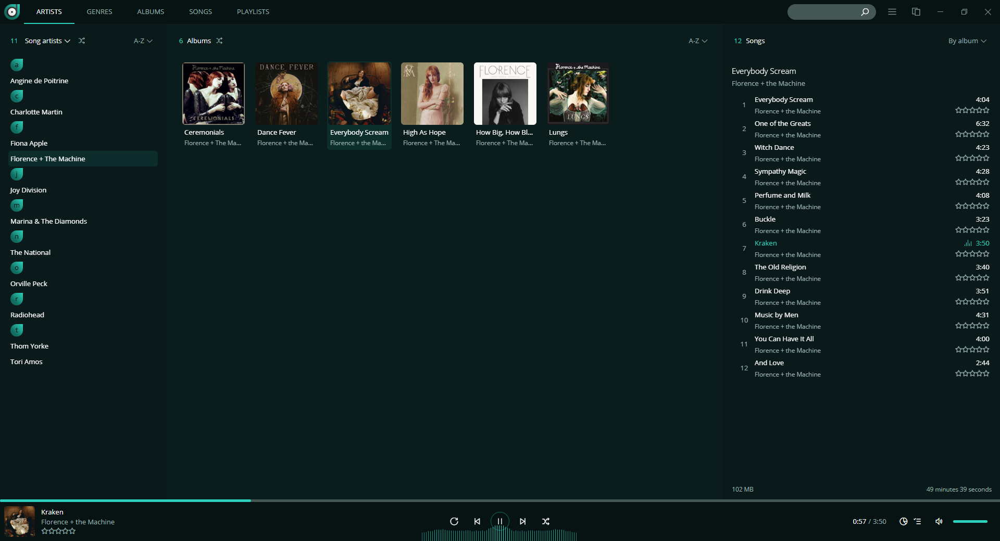
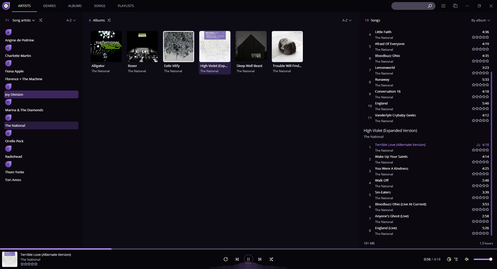
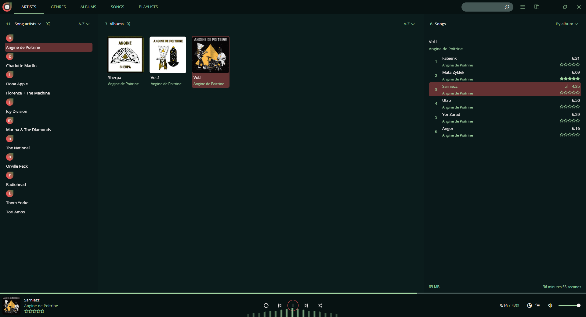

# Dopamine

Dark colour themes for Dopamine audio player.

The default teal coloured themes were too washed out for my liking so I created something easier for the eyes -- and then went ahead and made two more because why not. Note that I couldn't find a variable for the settings' main font colour, so for now it's a bit too low contrast to my liking.

Free to use and meddle with.
 
 
 

## Stormy Sea: 
- Monochromatic dark teal green theme.   

 
 
 

## High Violet: 
 - Moody purple/violet sister to Stormy Sea.   

 
 
 

## Garden: 
- More colourful variation of Stormy Sea.   

 
 
 

## How to:

1. Download a theme of your choice. Go to the file, and from the upper right corner click "Download raw file".
   - [Stormy Sea](https://github.com/jehelk/dopamine/blob/main/StormySea/StormySea.theme)
   - [High Violet](https://github.com/jehelk/dopamine/blob/main/HighViolet/HighViolet.theme)
   - [Garden](https://github.com/jehelk/dopamine/blob/main/Garden/Garden.theme)

2. In the player's settings make sure you have ticked off both "Follow the system theme" and "Use light theme". Ticking either one of these on after you have enabled a theme may make Dopamine switch to default theme and prevent you from selecting the theme again before you have ticked both selections off and restarted the player.

3. Click on "Add More Themes". Dopamine will automatically open the folder where themes go to. Drag and drop your downloaded theme into this folder, then close it.

4. You should be now able to select your new Dopamine theme.
